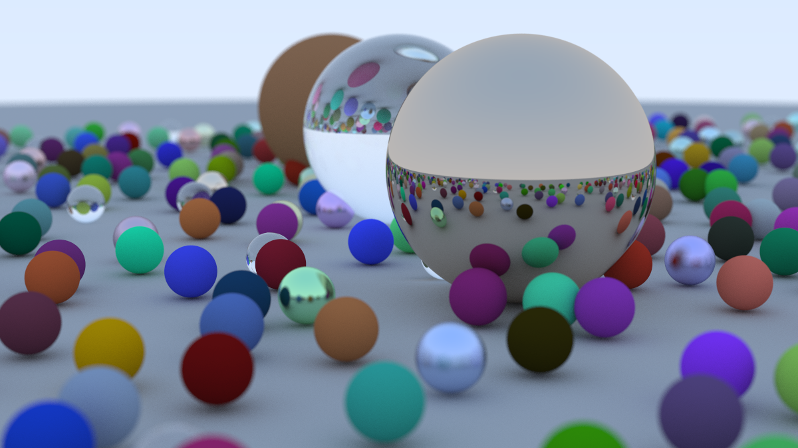

# Ray Tracing in One Weekend — C++ Implementation
 
A from-scratch C++ raytracer built by working through Peter Shirley's [*Ray Tracing in One Weekend*](https://raytracing.github.io/books/RayTracingInOneWeekend.html).
Renders a scene of spheres with diffuse, metal, and dielectric (glass) materials, antialiasing, and a positionable camera with depth-of-field, to a PPM image.
 
## Features
 
- **Vector math library** (`vec3`) with operator overloading, dot/cross products
- **Primitives**: spheres, with a `hittable` interface designed for easy extension
- **Materials** (via polymorphism, `material` base class):
  - Lambertian (diffuse) — true Lambertian-distributed scattering
  - Metal — with adjustable fuzziness for brushed/rough reflections
  - Dielectric (glass) — refraction via Snell's law, including total internal reflection
- **Antialiasing** via multiple random samples per pixel
- **Positionable camera** — configurable `lookfrom` / `lookat` / `vup`, field of view
- **Defocus blur (depth of field)** — simulated thin-lens camera model
- **Gamma-corrected output**, written as a PPM image
## Example Output
 


## Project Structure
 
```
.
├── include/            # Header files
│   ├── rtweekend.h      # Common constants & utilities, central include point
│   ├── vec3.h           # Vector math
│   ├── color.h          # Pixel color writing
│   ├── ray.h             # Ray class
│   ├── interval.h       # Numeric interval helper
│   ├── hittable.h       # Abstract hittable interface + hit_record
│   ├── hittable_list.h  # Collection of hittable objects
│   ├── sphere.h         # Sphere primitive
│   ├── material.h       # Lambertian / metal / dielectric materials
│   └── camera.h         # Camera, rendering loop, ray generation
├── source/             # Implementation files
│   ├── color.cpp
│   └── main.cpp         # Scene setup & render entry point
├── makefile
└── README.md
```
 
## Building & Running
 
```bash
make
./raytracer > image.ppm
```
 
The renderer writes a [PPM](https://en.wikipedia.org/wiki/Netpbm) image to standard output. Convert it to PNG for easier viewing, e.g. with ImageMagick:
 
```bash
magick image.ppm image.png
```
 
## What This Project Covers
 
This was built chapter by chapter, implementing each concept rather than copy-pasting:
 
- Ray-sphere intersection and surface normals
- Diffuse (Lambertian) reflection via random unit vector sampling
- Specular reflection and fuzzy metal materials
- Refraction and Snell's law, including total internal reflection and hollow-glass-sphere tricks
- A positionable camera built from an orthonormal basis (`u`, `v`, `w`)
- Depth-of-field via a simulated thin lens and defocus disk
## Credits
 
Based on [*Ray Tracing in One Weekend*](https://raytracing.github.io/) by Peter Shirley, Trevor David Black, and Steve Hollasch.
